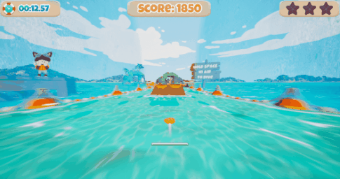

# Skippebble

My third semester project at S4G Berlin, and my first in Unreal Engine.   
As a Team of 9, in 10 weeks, we built an up-beat, high-speed stone skipping game.   
Players skip and steer a sand dollar with rhythmically precise input,   
racing through a carribean-inspired water parkour.

## Team
4 Artists, 3 Designers, 2 Coders, 1 Composer.

## Work
| | | | | | |
| :----: | :----: | :----: | :----: | :----: | :----: |
| **Programming** | Architecture | UI | Game States | Animation | Camera |
| **Production** | Backlog | Meetings | Coordination | Scrum | Presentations |

Similar to last project, I supported designers and artists to implement their own ideas, sometimes laying out a structure beforehand, sometimes refactoring afterwards to streamline the code structure.   
For example, when Stina (UI/UX) went ahead and coded a basic menu system, I followed up on her request for certain menu animations.   
I devised a system that i also provided her documentation and briefings for, so she could implement those animations herself.   
Another example was Aljoscha's (3D Art) sound system, which I adapted to work with our scene switching needs.   

## Engineering

### Tutorial, Camera + Pause

<table>
  <tr>
    <td width=50%>
		We wanted a tutorial, but were limited on resources. 
		Sign Posts are classic solution, but hard to read at high speeds. 
		Our solution: Pause game and zoom in on sign. 
		We came up with an architecture to support this, which we could re-use for level end tracking shot.
	</td>
    <td></td>
  </tr>
</table>

### Interactions
To trigger interactions such as speed boost, score, tutorial camera, we use a system of "sibling components",
such as PauseCamera and PauseCameraReceiver ("pause the game and change the camera").
PauseCamera acts as the trigger, saying what will happend and providing parameters.
PauseCameraReceiver actually implements the desired effect.
The control flow is thus:
<table>
  <tr>
	  <td width=75%>
		
	  </td>
  </tr>
  <tr>
	<td>
		<ul>
			<li>Player(Stone) overlaps TutorialSign's TriggerBox</li>
			<li>TutorialSign calls PauseCamera component</li>
			<li>PauseCamera component interface-calls into Stone</li>
			<li>Stone forwards interface call to PlayerController</li>
			<li>PlayerController calls PauseCameraReceiver</li>
			<li>PauseCameraReceiver dispatches event</li>
			<li>Other components react to it</li>
		</ul>
	  </td>
  </tr>
</table>

### Launcher
<table>
	<tr>
		<td rowspan="2">
			The Launcher shoots players into the level. 
			This seemingly small feature required realitvely heavy refactoring,  
			as it touches on many systems. 
			Thus it revealed and informed us about the needs for our architecture.
		</td>
		<td colspan="2">
			Adjacent systems:
		</td>
	</tr>
	<tr>
		<td>
			<ul>
				<li>Stone</li>
				<li>Reset</li>
				<li>Camera</li>
			</ul>
		</td>
		<td>
			<ul>
			<li>Game Phase</li>				
			<li>Animation</li>
			<li>Spawning</li>
			<li>Widget</li>
			</ul>
		</td>
	</tr>
	<tr>
		<td colspan="3">
			
		</td>
	</tr>
</table>

## Work Style

### Blueprints
<table>
	<tr>
		<td>
			First time working with visual scripting I enjoyed the ability to convey information simply by layouting the graph.
		</td>
	</tr>
	<tr>
		<td>
			
		</td>
	</tr>
	<tr>
		<td>
			This PlayerController blueprint was my biggest feature. I implemented it as Facade to keep it modular.
		</td>
	</tr>
	<tr>
		<td>
			
		</td>
	</tr>
</table>

### Tasks + Submits documentation
<table>
	<tr>
		<td width="25%">
			Generally I try to keep submits small and submit messages to the point. 
			However, when I do more rigorous bugfixes or refactors like this one, I make sure to document my rationale and changes in appropriate detail. 
			I take advantage of Perforce's Markdown Support, also linking the submit to the task card on our production tool, Taiga.
		</td>
		<td>
			
		</td>
	</tr>
</table>

## Production Learnings
Time lost to sickness cannot be recovered and must be accounted for in advance.   
Production information presented in a sleek, visual manner can be more effective than comprehensive, detailed backlogs   
(for our Post Production sprint we chose a table on Miro over our Taiga taskboard - for extra agility).

