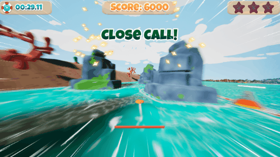

# Skippebble

My third semester project at S4G Berlin, and my first in Unreal Engine.   
As a Team of 9, in 10 weeks, we built an up-beat, high-speed stone skipping game.   
Players skip and steer a sand dollar with rhythmically precise input,   
racing through a carribean-dream style water parkour.

## Work
| | | | | | |
| :----: | :----: | :----: | :----: | :----: | :----: |
| **Programming** | Architecture | UI | Game States | Animation | Camera |
| **Production** | Backlog | Meetings | Coordination | Scrum | Presentations |

Similar to last project, I supported designers and artists to implement their own ideas, sometimes laying out a structure beforehand, sometimes refactoring afterwards to streamline the code structure.
For example, when Stina went ahead and coded a basic menu system, I followed up on her request for certain menu animations, i devised a system that i also provided her documentation and briefings for, so she could implement those animations herself.
Another example was Aljoscha's sound system, which I adapted to work with our scene switching needs.
The state machine in our player controller was my biggest structural undertaking. To be clear, this had little relation to the stone's movement , which was Tommy's domain.

## Engineering

### Blueprint cleanliness

I think it's important to format blueprints to be as reader friendly as possible.   
Tidiness is no great engineering feat but it goes a long way in strengthening my code morale and easing future maintanence and debugging work.   

### Tutorial, Camera + Pause
   
We wanted a tutorial, but were limited on resources. Plain sign posts were too hard to read for speedy players.   
Me and Tommy and conceived a plan for how we could structure all kinds of interaction in the game in a regular fashion.   
This made the task less complex than it would have been otherwise.   
It was also worth the effort because the camera transition system could be re-used or adapted for other features, such as the level finish sequence.   

### Launcher
The Launcher starts the player into the game, and also any time the stone resets upon sinking.
This seemingly small feature required some heavy refactoring, as it was implemented fairly late but touched on many systems and thus revealed the need to invest in better structure.   

This is the list of systems this feature interacts with.
- Stone
- Reset
- Camera
- Animation
- Spawning
- Widget
   
Whenever I do more rigorous bugfixes or refactors like this one, I make sure to document my rationale and changes in appropriate detail.
   
Here for example, I take advantage of Perforce's Markdown Support, also linking the submit to the task card on our production tool, Taiga.

## Production Learnings
Time lost to sickness cannot be recovered and must be accounted for in advance.
Production information presented in a sleek, visual manner can be more effective than comprehensive, detailed backlogs, especially when the production tool is not suited for presenting a lot of information on limited screenspace.

## Team
4 Artists, 3 Designers, 2 Coders, 1 Composer.

